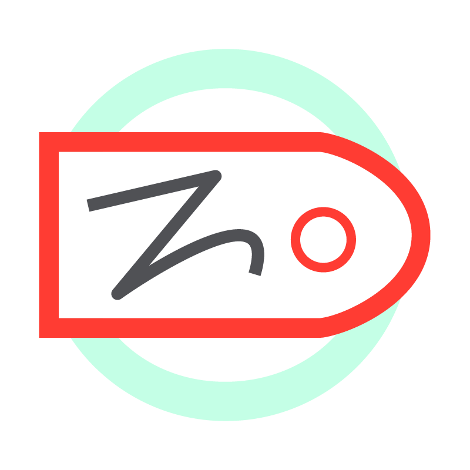
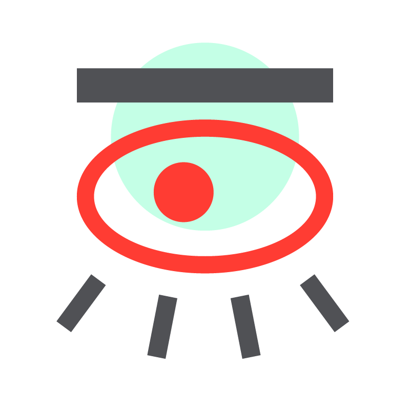
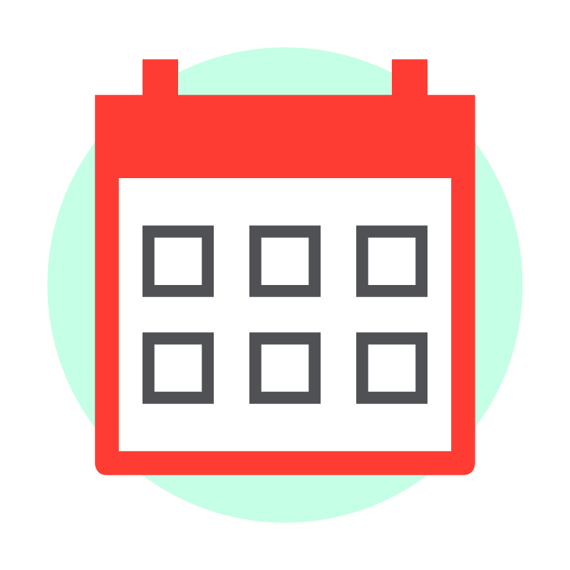
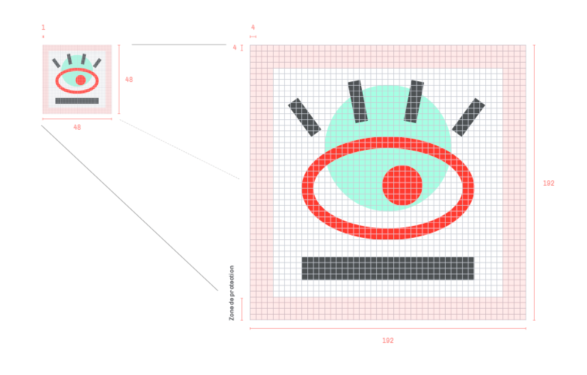
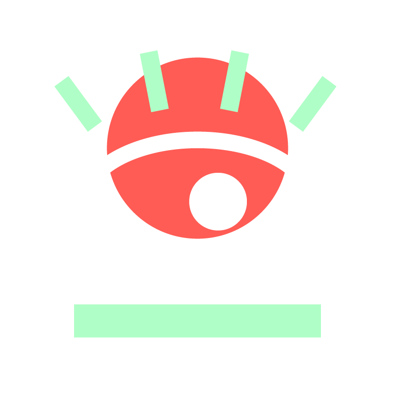
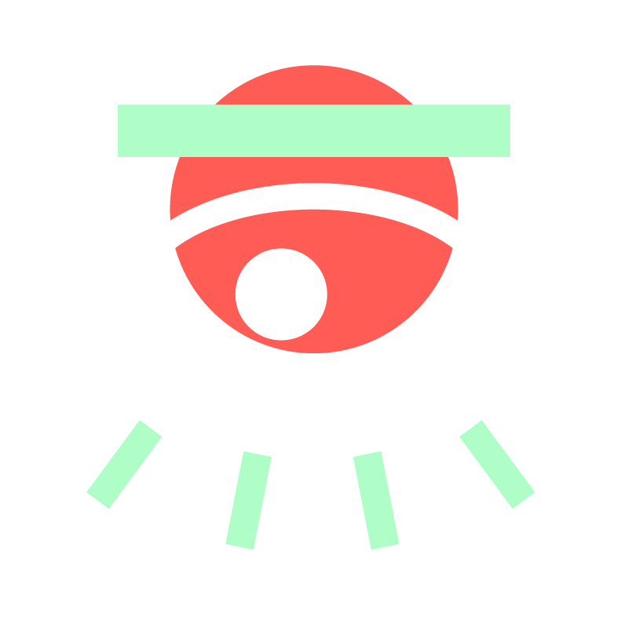
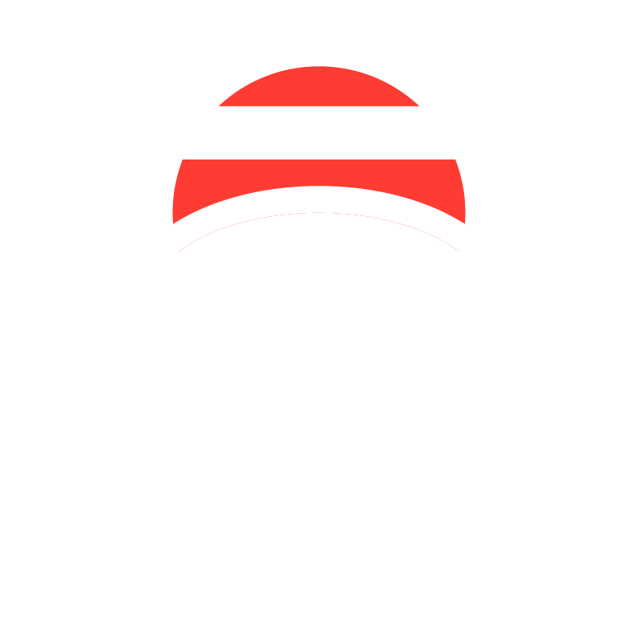

Iconographie
===========================================================================

L’identité de la radio est complétée par un jeu d’icônes. Elles représentent des parties du site internet, des éléments sonores, des typologies d’émissions.

Elles sont conçues pour être **simples**, **reconnaissables**, **amusantes**, **didactiques** et un peu **fantaisistes**. Chaque icône peut se réduire à très petite échelle, comme s’exposer en grand.Elles sont colorées avec les couleurs principales de la radio, mais peuvent changer d’aspect en fonction des situations ou des thèmes.

De la même manière, certaine parties des icones peuvent disparaître ou apparaître.

  

    
    
Antenne

  

  

    
    
Auteur.ice

  

  

    
    
Catégorie

  

  

    
    
Programme

  

  

    
    
Phare

  

  

    
    
Son

  

  

    
    
Tag

  

  

    
    
Timeline

  

  

    
    
Reliée

  

  

    
    
Focus

  

  

    
    
Écoute

  

  

    
    
École

  

  

    
    
Durée

  

  

    
    
Date

  

  

    
    
Play

  

*****

Grille
---------------------------------------------------------------------------

Les icônes sont construites sur une grille de 48 x 48 px. Chacune des unités de la grille représentent un pixel. À la création, elles furent assemblée sur une grille de 192 px, soit à 400% de leur taille initiale, pour leur offrir une définition optimale.

Les icônes possèdent également leur zone de protection, équivalente à 4 unité. Elle permet de positionner les icônes avec précision et élégance dans les compositions, et leur assure une bonne lisibilité.

*****

Ratio & Homothétie
---------------------------------------------------------------------------

<figure style="text-align:center;">
    
    
    
    
    
</figure>

Pour l’emploi des icones, lorsqu’on les agrandi ou rétréci, il est essentiel de *préserver un ratio de 4*. Cela leur permet de conserver un aspect et un alignement parfait, sans déformation.

Ne réduisez pas les icones à une **taille inférieure à 8mm**. Sinon, elles deviendront illisibles et risque de donner de mauvais résultat à l’impression.


Sous leurs **versions vectorielles**, les icones peuvent être agrandies sans limites, tout en respectant le ratio de 4.


*****

Couleurs
---------------------------------------------------------------------------

Les icônes sont assorties en *huit ensembles colorés*, correspondant soit à un thème, soit à un état.

L’ensemble prioritaire, et qui correspond aux besoins d’utilisation principaux, et l’ensemble « **classique** ». Cependant, il peut être nécessaire d’employer une icône sur un fond coloré, sur une image, ou pour signifier une information.Ainsi, ces ensembles viennent répondre à ces demandes.


Ces ensembles ne sont pas exhaustifs, d’autres combinaisons de couleurs peuvent apparaître sur le site internet sans être décrite ici.


****

### Classiques

Ce sont les icônes d’**emploi prioritaire**, avec les couleurs principales de la radio.

  

  

  

  

  

  

  

Télécharger l'ensemble
.png
.tiff
.eps
.svg

****

### Thème vert
Les couleurs des icônes sont adaptées à un fond vert, en étant notamment soulignées de blanc.

  

  

  

  

  

  

  

Télécharger l'ensemble
.png
.tiff
.eps
.svg

****

### Thème rouge

Pour l’utilisation des icones sur des surfaces rouges, ou au sein du thème rouge.

  

  

  

  

  

  

  

Télécharger l'ensemble
.png
.tiff
.eps
.svg

****

### Thème nuit
Cet ensemble d’incônes est adaptés aux couleurs « *nuits* », et aux surfaces sombres.

  

  

  

  

  

  

  

Télécharger l'ensemble
.png
.tiff
.eps
.svg

*****

### Inactives
À utiliser pour montrer que l’élément représenté par l’icône est désactivé ou manquant.

  

  

  

  

  

  

  

Télécharger l'ensemble
.png
.tiff
.eps
.svg

*****

### Sur image

Icones pour une utilisation sur image foncée. Pour des images claires, utiliser la série classique.

  

  

  

  

  

  

  

Télécharger l'ensemble
.png
.tiff
.eps
.svg

*****

### Exploration

Cet ensemble d’icone est utilisé au sein de la section exploration du site internet, et peux être utilisé comme alternative au thème vert.

  

  

  

  

  

  

  

Télécharger l'ensemble
.png
.tiff
.eps
.svg

****

### Noir
Ensemble d’icone en une seule couleur, adapté aux documents en noir et blanc.

  

  

  

  

  

  

  

Télécharger l'ensemble
.png
.tiff
.eps
.svg

