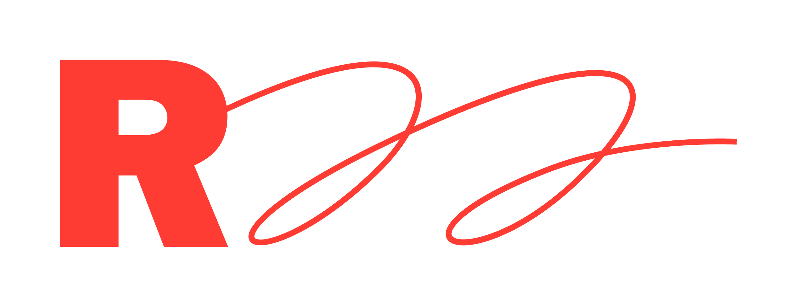
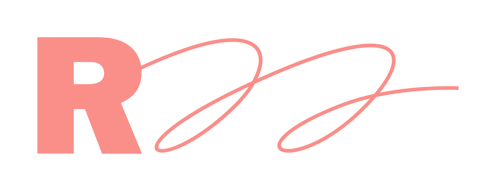
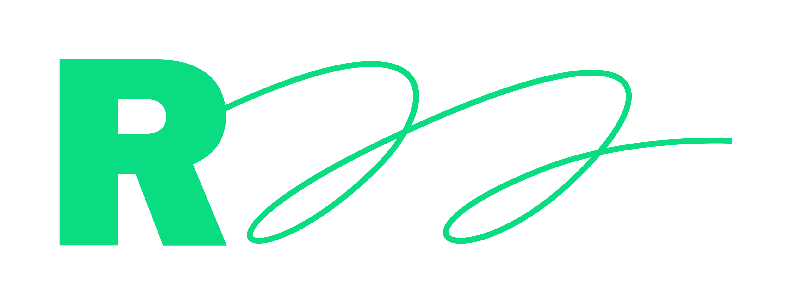
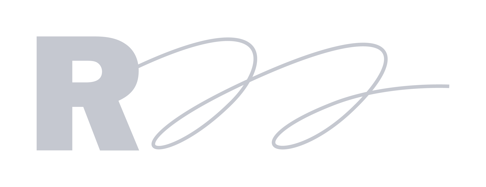
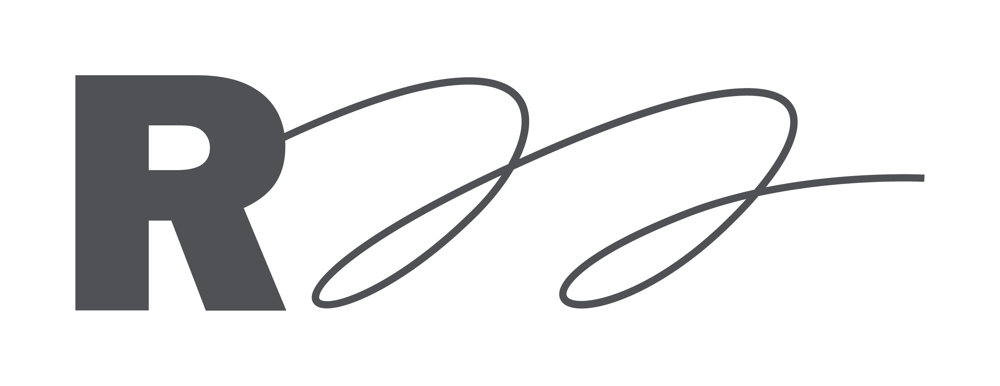
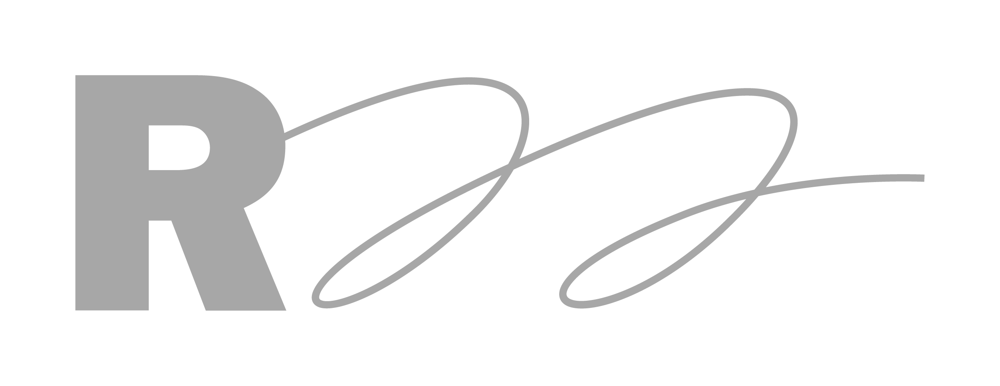
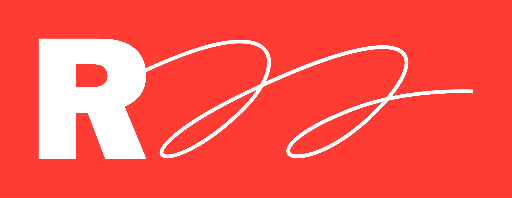
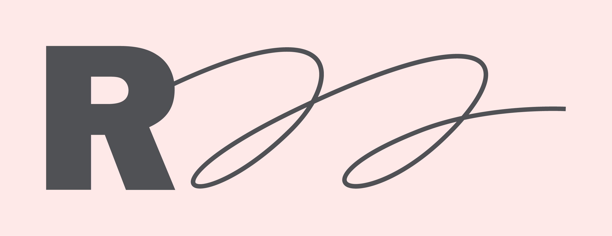
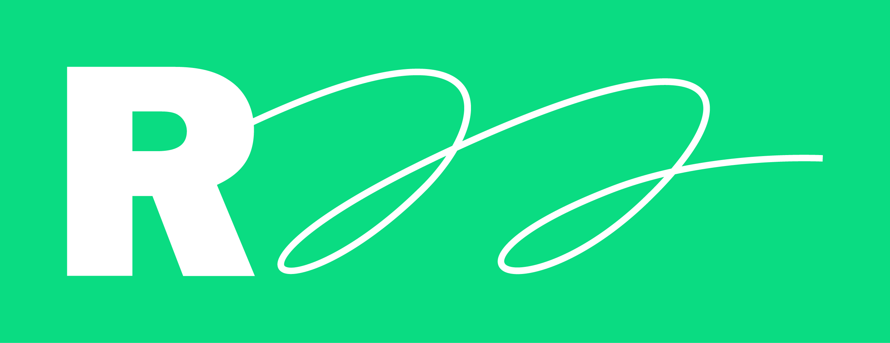
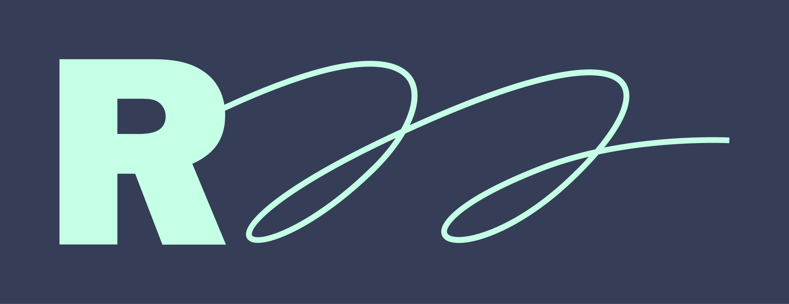

Logotype
========================================================================

Cette section présente le logotype de la r22, ses formes utilisations, couleurs et usages. Ainsi que les différentes conditions sous lesquelles il peut être utilisé.

Le logo de la r22 à été dessiné par *Pierre Tandille*. Il existe ici dans une version simplifié, sans son cadre rouge. Le logo est utilisé majoritairement en positif (rouge majeur) et en blanc. Il existe également en plusieurs autres couleurs.

<figure class="figure_cartouche" style="border:0">
	
	
	
</figure>

*****

Zone de protection
---------------------------------------------------------------------------

<figure class="figure_cartouche" style="border:0">
	
</figure>

Le logo de la r22 peut être disposé librement en respectant la zone de protection. L’espace minimum est représenté par la hauteur et la largeur (fût) du « R ».


Aucun élément graphique ne doit franchir la zone de protection du logotype. Cette zone libre doit être maintenue, pour en assurer un bon positionnement et une bonne lecture.


*****

Couleurs
---------------------------------------------------------------------------

Les couleurs présentées ici **sont les seules** à pouvoir être utilisées avec le logotype. Il est interdit de l’employer avec d’autres couleurs, même celles décrites à la suite de la charte. Pour connaître le détail des couleurs, reportez-vous à la section correspondante.


Si vous avez des doutes concernant la couleur à choisir pour le logotype, **utilisez la version classique**.



Les thèmes demandent des couleurs spécifiques, n’utilisez pas un logotype d’une autre couleur que celle demandée par son thème !


Pour plus d’informations sur les thèmes et leur conditions d’utilisations, reportez-vous à la section correspondante.



<figure class="figure_cartouche">
  
	

	
	Rouge Tonique
	

</figure>

<--->

### Classique
La version générale du logo. **À privilégier dans les documents de communication.**




<figure class="figure_cartouche">
	
	

	
	Rouge Mediante
	

</figure>

<--->

### Médiante
Une alternative de la version générale. À employer dans les situations où le rouge majeure est trop fort.




<figure class="figure_cartouche">
	
	

		
		Vert Majeure
	

</figure>

<--->

### Vert
À employer uniquement au sein du thème vert.




<figure class="figure_cartouche">
	
	

		
		Nuit Majeure
	

</figure>

<--->

### Nuit
À utiliser uniquement si la version labeur est trop faible. Pour des supports et impressions en couleurs.




<figure class="figure_cartouche">
	
	

		
		Nuit Sensible
	

</figure>

<--->

### Nuit sensible
Version grisée à utiliser pour les supports et impressions en couleurs.




<figure class="figure_cartouche">
	
	

		
		Labeur
	

</figure>

<--->

### Labeur
La version noir générale, à utiliser pour les supports et impressions en couleur, sur fond clair.




<figure class="figure_cartouche">
	
	

		
		Noir 45%
	

</figure>

<--->

### Gris neutre
Version grisée à utiliser pour les supports et impressions  en noir & blanc.




<figure class="figure_cartouche">
	
	

		
		Noir 100%
	

</figure>

<--->

### Noir
À utiliser pour les supports et impressions en noir & blanc, sur fond clair.



*****

Les cartouches
---------------------------------------------------------------------------

<figure class="figure_cartouche" style="border:0">

</figure>

Le logotype de la r22 peut être encapsulé au sein d’un rectangle de couleur — *cartouche*. Ses dimensions correspondent à celle de la zone de protection du logotype.La cartouche possède également sa propre zone de protection.

### Cartouche classique
La version classique de la capsule, en rouge Majeure, à privilégier dans les documents de communication.

<figure class="figure_cartouche">
  
   Rouge Tonique
   Blanc
</figure>

### Cartouche Rouge
Cette capsule est à utiliser uniquement au sein du thème rouge, ou dans des univers à tendance rouge.

<figure class="figure_cartouche">

 Rouge Mineure
 Labeur
</figure>

### Cartouche Verte
Cette capsule est l’équivalente de la capsule classique, au sein de l’univers vert.

<figure class="figure_cartouche">
  
   Vert Majeure
   Blanc
</figure>

### Cartouche Nuit
La capsules au sein de l’univers sombre. À utiliser principalement en numérique.

<figure class="figure_cartouche">
  
   Nuit Majeure
   Vert Mineure
</figure>

*****

L'Icon
---------------------------------------------------------------------------

<figure class="figure_cartouche" style="border:0">
 
 
 
 </figure>

Le logo peut se réduire à une icon pour certaines occasions. **C’est l’identifiant le plus fin de la r22**. Il communique d’une façon simple, épaisse et amicale. Il est visuellement distinct du logo, mais lui est soumis dans son concept et son application.


L’icon ne peut remplacer le logo que lors de cas très particuliers. Par exemple, quand il n’est pas possible d’afficher le logo, par manque de place. Où en signature très fine de certains documents.


*****

Les tailles minimales
---------------------------------------------------------------------------
Par soucis de lisibilité, n’employez pas de tailles plus petites que celle-ci.

<figure class="figure_cartouche">
	
	<code style="vertical-align:middle; margin:0 2em 0 1em;">20 mm •  96px</code>
</figure>

<figure class="figure_cartouche">
	
	<code style="vertical-align:middle; margin:0 2em 0 1em;">24 mm • 128px</code>
</figure>

<figure class="figure_cartouche">
	
	<code style="vertical-align:middle; margin:0 2em 0 1em;">8 mm • 36px</code>
</figure>

*****

Utilisations interdites
---------------------------------------------------------------------------
<figure class="figure_cartouche">
	
	
	
	
	<figcaption style="border-top:0.5em solid #FF3C33; padding-top:0.5em;">Ne pas faire</figcaption>
</figure>

| Nom | Description |
|-----|-------------|
| Modification des couleurs | **Ne modifiez pas les couleurs** du logotype, ne l’employez pas avec d’autres combinaisons que celle présentées dans la charte. |
| Déformation du logotype | **Ne déformez pas** le logotype. Ne changez pas sa taille sans en respectez l’homothétie. |
| Orientation du logotype | **Ne modifiez pas l’orientation** du logotype, il doit toujours être à l’horizontale. |
| Ancienne version | Sauf si la création du document utilisé est antérieure à la refonte du site internet, **n’employez pas le logotype avec un cadre rouge**. |
| Mélange de couleurs | **Ne mélangez pas les couleurs**. Employez de préférence la version du logotype qui correspond au thème choisi. |
| Modifier le logotype | Ne modifiez, ou ne transformez pas le logotype. Il doit, en tout occasion, **rester conforme à sa forme actuelle**. |

****

Téléchargement
---------------------------------------------------------------------------

Vous pouvez télécharger les fichiers du logotype. Il y est présent en toutes ses couleurs, ainsi que sous la forme de cartouche.

Télécharger l'ensemble

Pour des besoins spécifiques, voici ses différent formats :

.png
.tiff
.svg
.eps
