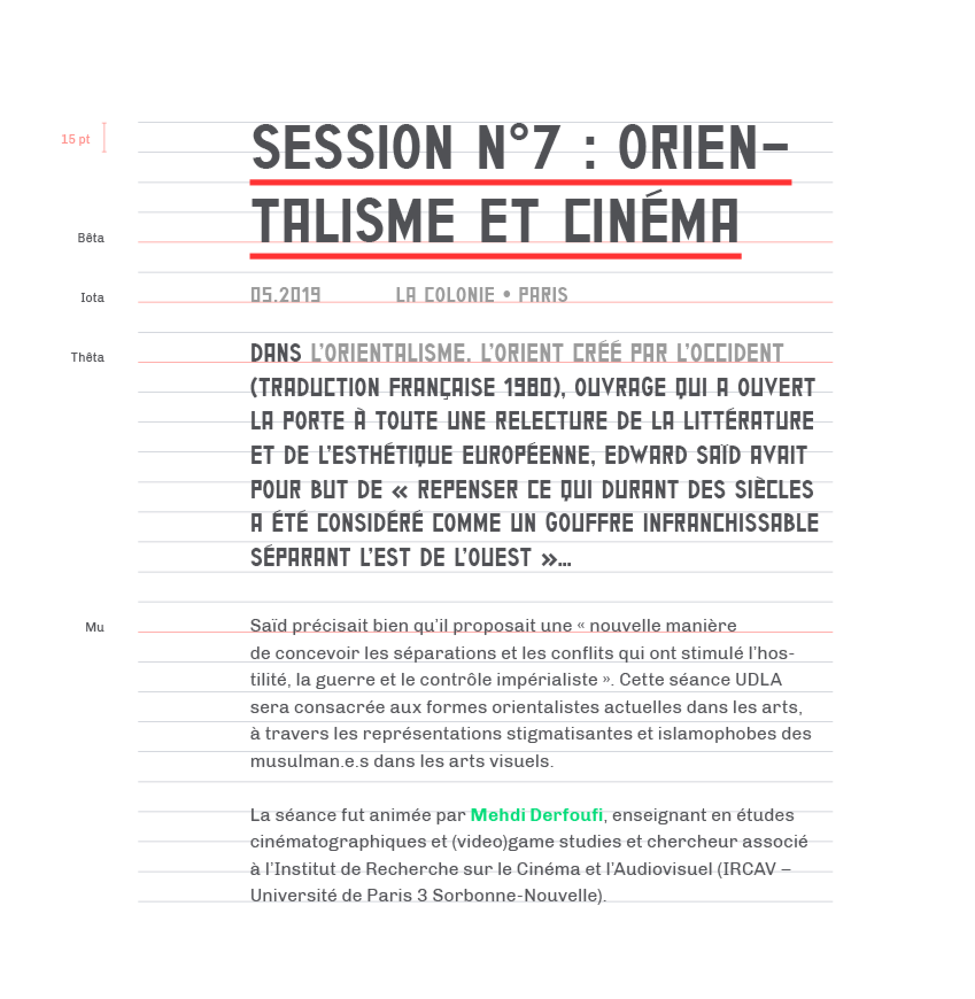

Composition générale
===========================================================================

Le texte, dans l’identité de la r22, se compose autour de la publication. C’est la forme que prend la mise en ligne d’un son sur le site internet. Elle est composée d’un **titre**, d’un **article**, d’**images**, d’**informations** et de **crédits**.


Au sein des documents de communication, la mise en forme du texte est similaire à la construction effective sur le site internet.


Le texte est, par ailleurs, souvent accompagné d’images, de liens & références et d’informations (biographies, crédits).
Les pages suivantes présentent les **différentes formes** que prennent chacun des ces éléments.

****

Titraille
---------------------------------------------------------------------------

<figure style="border:1px solid #eee; padding:1em;">
  BERNARD HEIDSIECK, (1928-2014), PARTITION N

  *— Chapô • Thêta*
  Labeur
  Rouge Tonique
</figure>

Le titre est composé en *Al Kashi*, et est souligné d’un *trait rouge tonique*. Sa casse est uniquement en lettre capitale.

C’est un élément très identifiant pour la radio. La *Al Kashi* est une typographie visuellement très forte, qui est utilisée depuis les début de projet. Elle permet de composer des titres commes des blocs, qui s’assemblent les uns sur les autres. Le soulignement **renforce cet effet**.


Les titres doivent apparaître sur chaque document de communication, presque toujours en premier, sur le dessus.


Le choix de la taille d’un titre se fait en fonction du nombre de caractères. Plus il y a de caractères, plus la taille du titre sera petite. De manière générale, le titre ne prend pas beaucoup de place en largeur, pour accentuer l’effet d’empilement. Les césures sont autorisées dans les titres, notamment pour les mots long mais doivent être évitées si possible.

*****

Chapô
---------------------------------------------------------------------------

Le texte est toujours accompagné d’un chapô. Il est placé entre le titre et le texte pour inciter à lire le document, il en précise le contenu, il en dévoile l’angle. Il permet de mettre du texte en emphase forte.

<figure style="border:1px solid #eee; padding:1em;">

Dans L’Orientalisme. L’Orient créé par l’Occident (traduction française 1980), ouvrage qui a ouvert la porte à toute une relecture de la littérature et de l’esthétique européenne,<a>Edward Saïd</a> avait pour but de « <em>repenser ce qui durant des siècles a été considéré comme un gouffre infranchissable séparant l’Est de l’Ouest</em> »…

*— Chapô • Êta*

Dans L’Orientalisme. L’Orient créé par l’Occident (traduction française 1980), ouvrage qui a ouvert la porte à toute une relecture de la littérature et de l’esthétique européenne,<a>Edward Saïd</a> avait pour but de « <em>repenser ce qui durant des siècles a été considéré comme un gouffre infranchissable séparant l’Est de l’Ouest</em> »…

*— Chapô • Thêta*

Labeur
Noir médiante
Vert majeure

</figure>

Il est composé en **Al Kashi**, sans soulignement, en capitales.


Sa taille varie entre deux phrases à deux paragraphes. Le choix entre ces variations s’effecture en fonction de la taille du texte, ou du document. **Un chapô doit toujours donner l’impression de ne pas faire plus d’un quart de la taille d’un texte**.


Certains mots d’un chapô peuvent être mis en *italiques*. Cependant, la Al Kashi ne possède pas d’italique, ainsi ils seront colorés une couleurs en dessous de la couleur du texte. Par exemple, pour un texte en *labeur*, les mots en italiques seront en *noir médiante*. Les tailles de chapô peuvent également servir à composer des sous-titres ou sur-titres.

****

## Paragraphes

Les paragraphes et textes courants sont composés en Chivo, avec les graisses *regluar*, *bold*, et leurs *italiques*.

<figure style="border:1px solid #eee; padding:1em;">

Arc & Flèche — En 2017, l’artiste visuelle brésilienne <a>Ana Vaz</a> sera en résidence à l’<a>Espace Khiasma</a> autour de sa trilogie <b>Le Jaguar bleu</b>, qui prend comme motif et symbole des îles à la fois réelles et imaginées pour fabuler de nouvelles formes de relations dans un monde hanté par l’imminence d’une <em>ruine écologique</em>.

*— Paragraphe • Kappa*

Arc & Flèche — En 2017, l’artiste visuelle brésilienne <a>Ana Vaz</a> sera en résidence à l’<a>Espace Khiasma</a> autour de sa trilogie <b>Le Jaguar bleu</b>, qui prend comme motif et symbole des îles à la fois réelles et imaginées pour fabuler de nouvelles formes de relations dans un monde hanté par l’imminence d’une <em>ruine écologique</em>.

*— Paragraphe • Lambda*

Arc & Flèche — En 2017, l’artiste visuelle brésilienne <a>Ana Vaz</a> sera en résidence à l’<a>Espace Khiasma</a> autour de sa trilogie <b>Le Jaguar bleu</b>, qui prend comme motif et symbole des îles à la fois réelles et imaginées pour fabuler de nouvelles formes de relations dans un monde hanté par l’imminence d’une <em>ruine écologique</em>.

*— Paragraphe • Nu*

Labeur
Noir médiante
Vert majeure

</figure>

Les graisses *light* et *black* ne sont pas employées dans le texte courant. Comme pour les chapôs, les *italiques* seront colorées une couleur en dessous de la couleur du texte.

Les noms propres, noms de lieux ou mots d’intérêts peuvent être mis en bold et colorés en *vert majeure*. Ils font références aux liens sur le site internet. Pour les documents de communication, le choix de cette mise en relief est laissé libre.


Le choix de la taille du paragraphe s’effectue en fonction du type de document, et de la taille du texte à composé. Chaque situation doit être étudiée pour trouver la taille idéale de composition.


****

Crédits
---------------------------------------------------------------------------
<figure style="border:1px solid #eee; padding:1em;">

  
Débat de <a style="color:#9B9B9B; font-style:normal;">Valérie Cabanes</a> & <a style="color:#9B9B9B; font-style:normal;">Elizabeth Povinelli</a> & <a style="color:#9B9B9B; font-style:normal;">Olivier Marboeuf</a> &<a style="color:#9B9B9B; font-style:normal;"> Louis Henderson</a> pour
  le programme : <a style="color:#9B9B9B; font-style:normal;">Geontopower : cartographie de la scène européenne de la critique du libéralisme tardif</a> et pour l’antenne : <a style="color:#9B9B9B; font-style:normal;">Tout-monde</a>.

— Credit • Mu>

Noir médiante

</figure>

Les crédits sont de courts paragraphes contenant des informations techniques, légales ou contextuelles.

Ils peuvent contenir, par exemple : les informations d’une publication : qui a enregistré, qui a monté/mixé, la date de l’enregistrement, le lieu de l’enregistrement, les partenaires, etc.

Les crédits se composent en **Chivo**, avec les graisse *light* et *blod*.

Les informations descriptives sont composées en *light italique*, et les noms, prénoms, définitions ou genres sont composés en *bold*. Les crédits sont presques toujours composés en **noir médiante**. Néanmoins, si le document le demande, ils peuvent être composé en **labeur**, ou en une couleur en dessous de la couleur de texte.

*****

Ligne de base
---------------------------------------------------------------------------

Pour les documents de communication, les éléments graphiques et typographiques s’alignent sur une ligne de base de `15pt`. La ligne de base permet aux espacements entre les éléments d’êtres **consistants entre tous les documents**.


Les éléments s’alignent presques exclusivement à partir de la première ligne, sauf pour les titres, qui peuvent s’aligner sur la dernière ligne.


C’est la ligne de base de composition médiante. Pour des compositions plus petites, il est possible d’utiliser la ligne de base équivalent à l’interlignage de `Mu`, ainsi `13.5pt`.

Attention, seule la permière ligne d’un paragraphe d’un bloc de texte s’aligne sur la ligne de base. Son deuxièment paragraphe reste assujeti à l’interlignage du paragraphe. Voir par exemple l’alignement du deuxième paragraphe du bloc de texte en taille `Mu` ci-contre. Il reste aligné sur une ligne de base de `13.5 pt`, qui est son interlignage.

