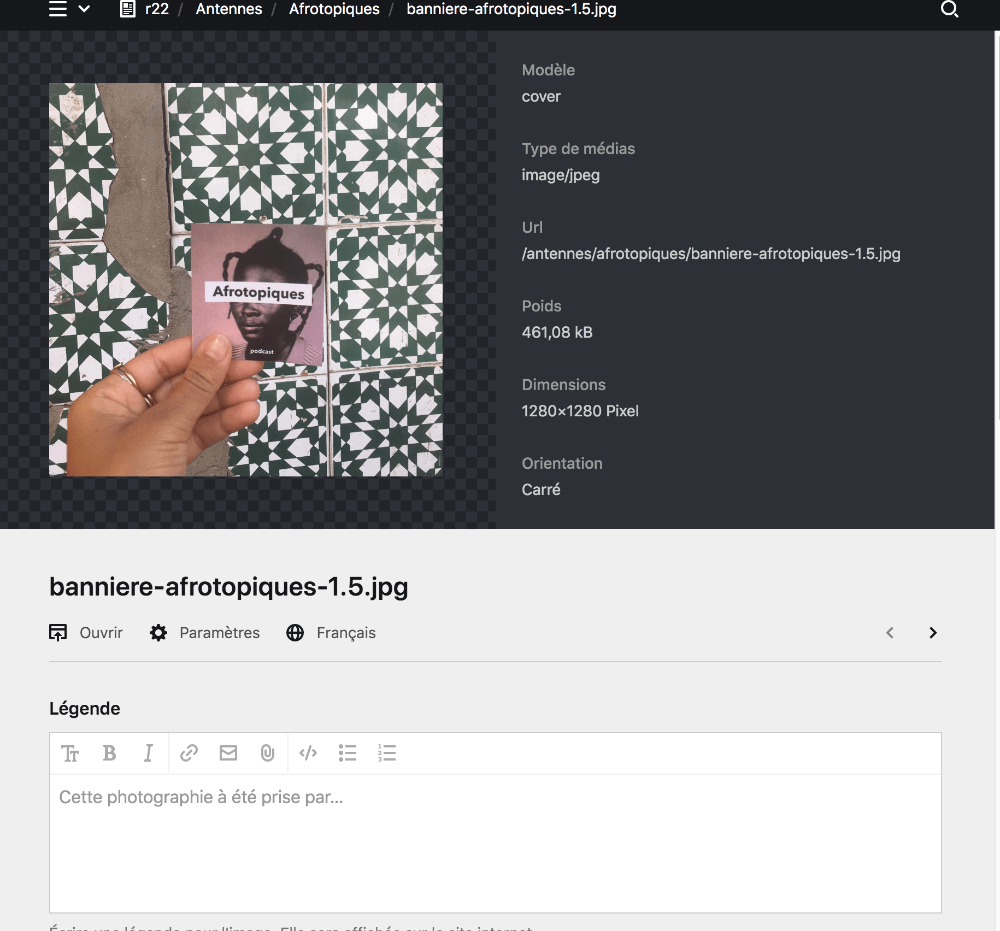
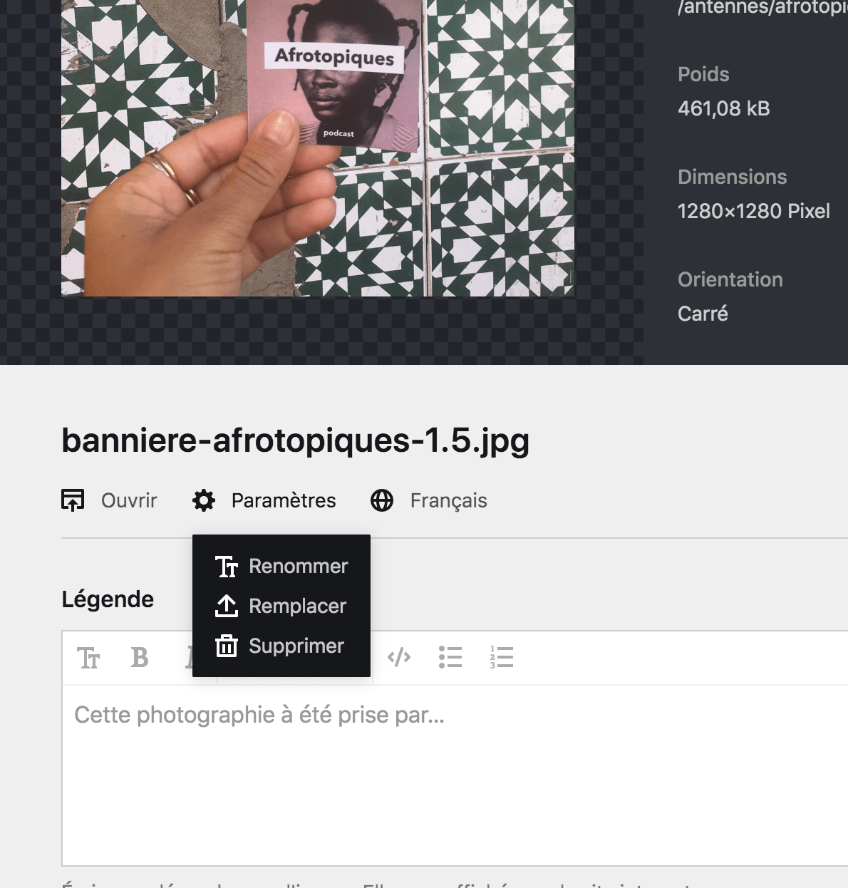
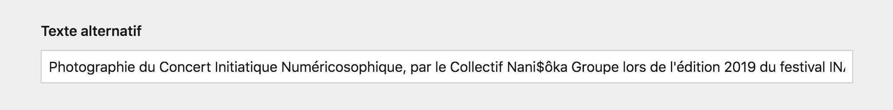
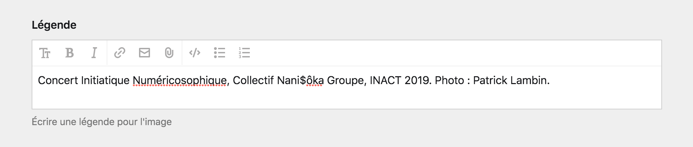

# Page de fichier

Le Panel vous permet de modifier les fichiers à partir de la **page du fichier**. C'est une page dédiée à un fichier qui vous présente de nombreuses informations le concernant, comme son nom, son poid, son type, etc. Pour les images, vous pouvez même trouver des informations concernant sa dimension ou son orientation.

Pour attendre la page d'un fichier, **vous devez cliquez sur la boîte d'un fichier à partir d'une section de fichier dans une page de contenu**, ou au sein champ de sélection de fichier.

Par exemple, la capture d'écran suivant nous montre la page d'une photographie utilisée comme couverture de la [page Festival](https://www.inact.fr/festival) du site.



## Paramètres du fichier

Depuis la page d'un fichier, vous avez accès à plusieurs paramètres pour celui-ci. Pour y accéder, cliquez sur le bouton ```Paramètres``` (accompagné d'une icône représentant un rouage). Une menu déroulant apparaîtera avec plusieurs options.



| Paramètre | Description |
|-----------|-------------|
| Ouvrir | Ce bouton vous permet **d'ouvrir le fichier dans votre navigateur**, depuis son URL média, ainsi d'accéder directement au fichier. |
| Renommer | Ce paramètre vous donne la possibilité de **renommer le fichier**. Ça peut être très utile pour s'y retrouver parmis de nombreux fichiers ou photographie, de leur donner des noms reconnaissables. |
| Remplacer | Ce bouton vous permet de **remplacer le fichier**, tout en conservant la page du fichier et les métadonnées renseignées. Très pratique pour mettre à jour une image avec une nouvelle version, sans perdre les modifications, par exemple. |
| Supprimer | Ce bouton vous permet de **supprimer un fichier** du Panel, et ainsi d'effacer sa page. |


**Attention** :
Si vous renommez un fichier utilisé par une page de contenu, **pensez à mettre à jour la sélection du ficher dans la page**. En effet, la sélection de fichier fonctionne grâce au nom de fichier, aussi, la page ne trouvera plus le fichier renommé parce qu'il aura changé de nom.


----

## Métadonnées

La page d'un fichier nous permet de renseigner des informations supplémentaires sur le fichier. Notamment son **texte alternatif** et sa **légende**. Ces informations sont très importante concernant les images (voir essentielles).

### Texte alternatif

Le texte alternatif accompagne un fichier et est affiché s'il est indisponnible. C'est notamment vrai pour les images, mais également les fichiers audios, vidéos ou les documents.

C'est également le texte qui sera lu lorsque le site sera visité par l'intermédiaire de lecteurs d'écran. Aussi, son rôle est de décrire l'image le plus simplement et efficacement possible.

Le texte alternatif joue également un rôle dans le S.E.O.[^1] et est pris en compte par les algorythmes des moteurs de recherche. Il contribue ainsi à l'optimisation du référencement du site internet.




**À propos** :
Le texte alternatif doit être composé avec du texte brut. Ainsi n'utilisez pas de [Markdown]() dans ce champ, il ne serait pas compris pas le site internet.


### La légende

La légende est également un texte qui accompagne l'image, mais qui cette fois-ci est affichée sur le site internet quand c'est possible. Elle permet de donner un contexte à l'image, ou d'afficher les crédits d'une photographie.

Par exemple, la capture suivante présente une image affichée sur le *front-office* avec sa légende.




[^1]: Le S.E.O., ou **Search Engigne Optimisation** (Optimisation des moteurs de recherche en français) sont les manières d'améliorer la lecture et l'indexation d'un site internet par les algorythmes des moteurs de recherche comme Google ou Yahoo. L'une de ces manières est le [référencement naturel](https://fr.wikipedia.org/wiki/Optimisation_pour_les_moteurs_de_recherche) pour lequel le texte alternatif joue.
