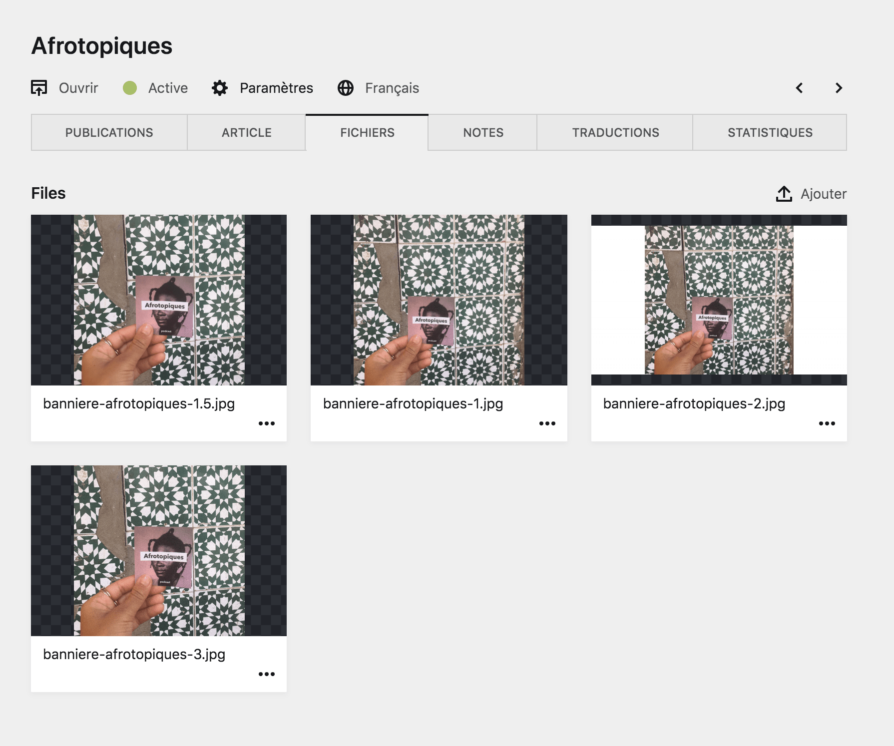
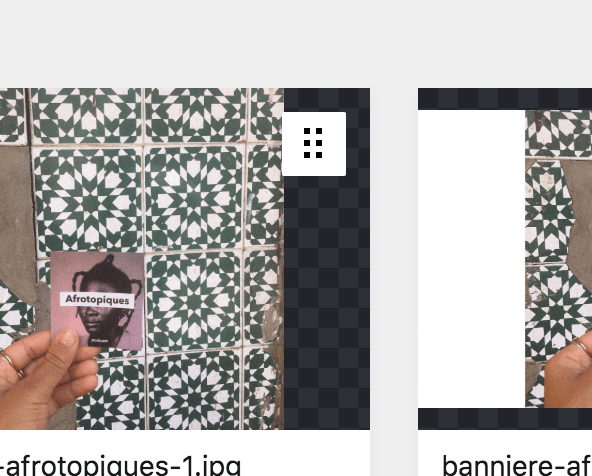

# Gérer les fichiers

Pour la pluspart des pages, vous verrez un onglet ```Fichiers``` à gauche de la barre d'onglet de la page, avec un accès rapide à tous les fichiers de la page.



## Outils

Cette section regroupe tous les fichiers qui ont été importé dans cette page de contenu. Vous pouvez cliquer sur un fichier pour accéder à sa page de fichier, ou alors gérer ses paramètres directement depuis cette section.

| Élément | Description |
|---------|-------------|
| Aperçu du fichier | Si le fichier est une image, vous avez un aperçu de celle-ci dans le corps de la **boîte de fichier**. Sinon, le fichier sera représenté par une icône proche de son type (Par exemple : un document pour un .pdf, une note de musique pour un .mp3…) |
| Nom du fichier | Le nom du fichier est affiché juste en dessous de l'aperçu. La plupart du temps, **les fichiers sont classés par ordre alphabétique**, ainsi il peut être intéressant de renommer les fichiers en amont pour s'organiser. |
| Bouton d'organisation des fichiers | Vous pouvez déplacez et ordonner les fichiers comme bon vous semble. Ceci, en cliquant sur le bouton en haut à droite de la boîte de fichier, qui **apparaît au survol**, et en déplaçant le fichier à l'endroit voulu. |
| Bouton ```…``` d'options supplémentaires | Ce bouton vous permet d'accéder au menu déroulant des [paramètres du fichier]() |

----

## Organiser les fichiers

Ici, le bouton composé de six petits carrés noir dans un carré blanc vous permet de déplacer les fichiers et de les organiser. Il **apparaît au survol** de la boîte de fichier avec la souris.


