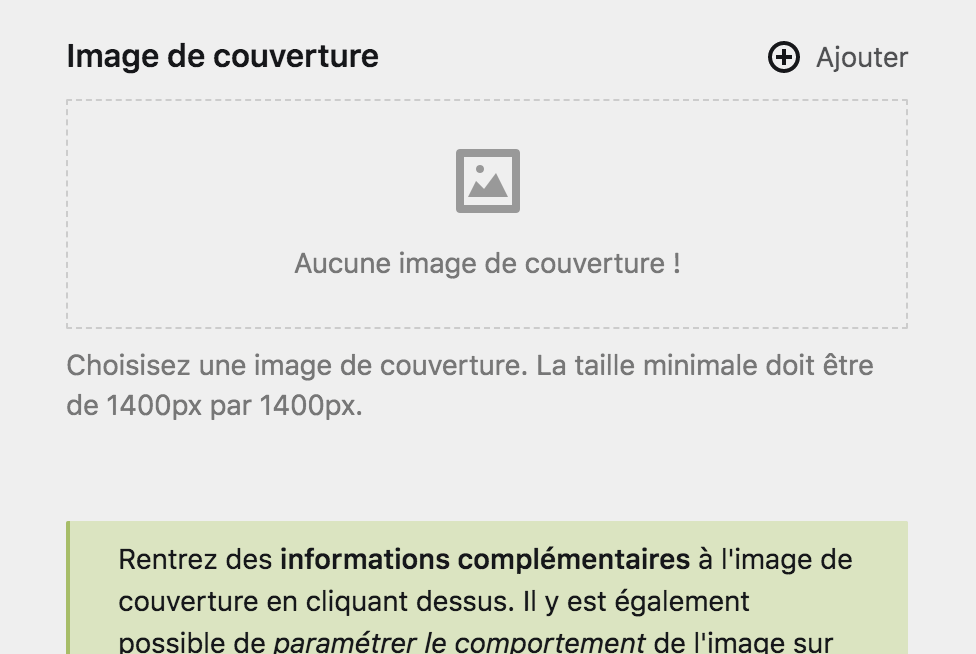
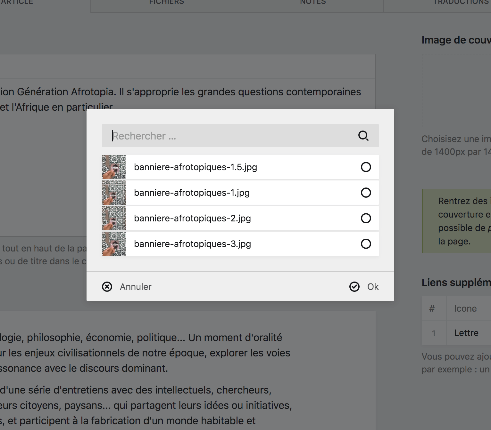
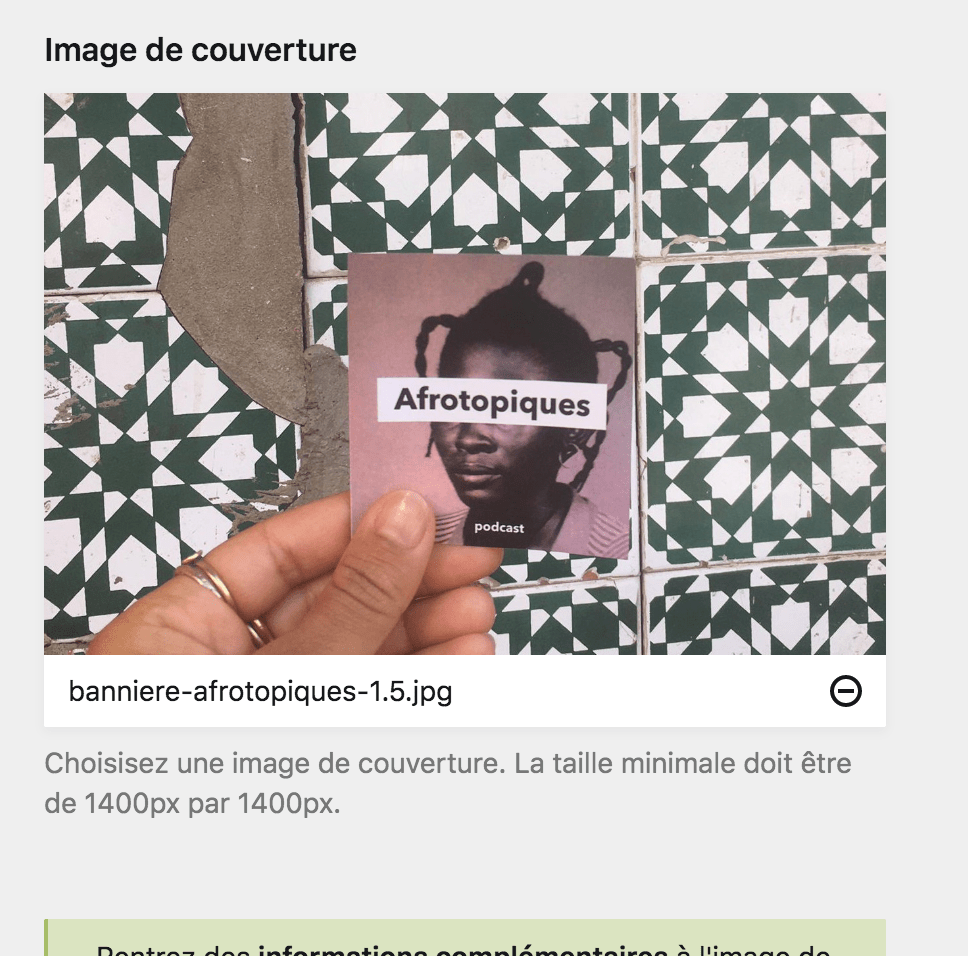
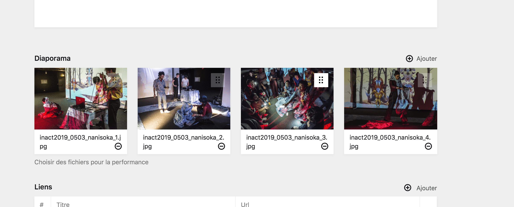

# Utiliser les fichiers

Pour utiliser des fichier au sein d'une page de contenu, vous devez d'abord les importer au sein de celle-ci. Ensuite, vous pourrez indiquer à la page quels fichiers utiliser parmi tout ceux que vous aurez importé.

Vous rencontrerez plusieurs type de **champ de sélection de fichiers** au sein du Panel, cette section couvre les plus communs, mais tous fonctionnent sur le même modèle. Avec un **état vide** et un **état rempli**.

## Champ de sélection de fichier unique

Par exemple, le champ suivant vous demande de choisir une image qui sera la couverture de la page parmis tous les fichiers importé sur la page. Le champ de sélection est en **état vide** et vous indique qu'aucun fichier n'a encore été sélectionné.



Lorsque vous cliquez sur le champ, ou sur le bouton ```+ ajouter``` un formulaire de sélection apparaît ou vous pouvez choisir un fichier adapté parmi ceux que possède la page.




**Conseil** :
Remarquez la **barre de recherche** au dessus du formulaire, elle vous permet de rechercher des fichiers par leur nom. Très utile si la page possède plusieurs dizaines de fichiers.


Une fois le fichier sélectionné, le champ afficera un **état rempli**, avec un aperçu du fichier. Le champ ne requiérant qu'un seul fichier, le bouton ```+ ajouter``` a disparu.

Si vous souhaitez changer le fichier, vous devez d'abord dé-sélectionner le fichier déjà choisi, pour ensuite en choisir un nouveau. Pour dé-sélectionner un fichier, cliquez sur le bouton ```-```.



----

## Champ de sélection de plusieurs fichiers

De la même façon qu'une champ de sélection de fichier unique, ce champ-ci possède un **état vide** et un **état rempli** et peut être rempli grâce à un **formulaire de sélection**.

Il est possible qu'un champ de sélection multiple ai un nombre limite maximal de fichier sélectionnés, à ce moment, le bouton ```+ ajouter``` disparaît du champ.


