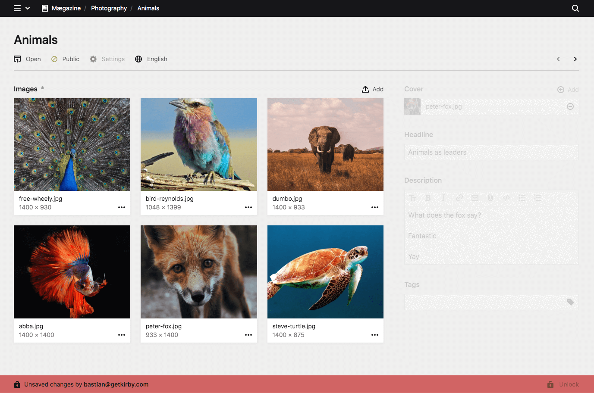
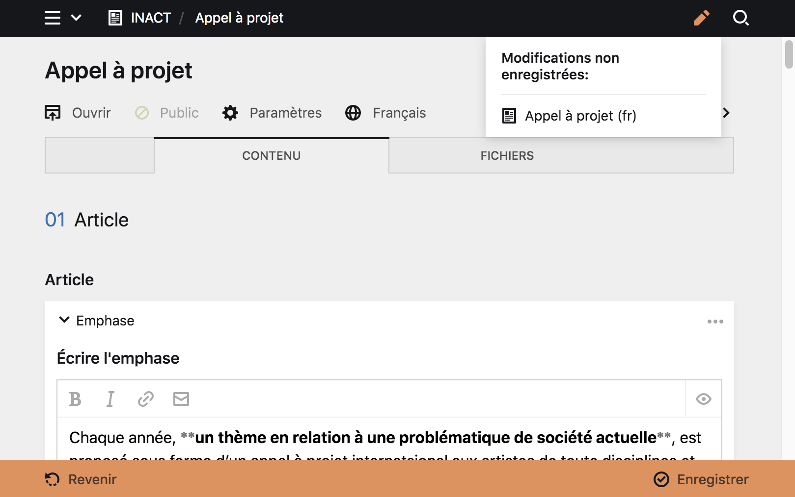

# Édition des pages et travail collaboratif

Plusieurs paramètres vous permettent de modifer le contenu des pages et d'éviter les pertes accidentelles de votre travail ou de celui de vos collaborateur·ice·s.

## Vérouillage de contenu

Le Panel va **automatiquement vérouiller les pages en train d'être éditée par un·e autre utilisateur·ice connecté·e au Panel**. Ainsi le travail équipe est beaucoup plus sûr. Si vous ouvrez une page en train d'être éditée par un·e autre utilisateur·ice, vous en serez informé et ne pourrez pas écraser leur changements.




**À propos** :
Cette fonctionnalité du Panel rappèle  pourquoi il est très important que [chaque utilisateur·ice possède un compte propre](). Comme cela, chacun·e peut travailler en toute sérénité.


****

## Modification non enregistrées

Quand vous éditez des pages, des fichiers ou des comptes utilisateur·ice, vous verrez une icone ```Modification non enregistrées``` représentée par un crayon, dans le [header]() du Panel. Cet apreçu des changements rend beaucoup plus simple le suivi des contenus dont la création est toujours en cours.


