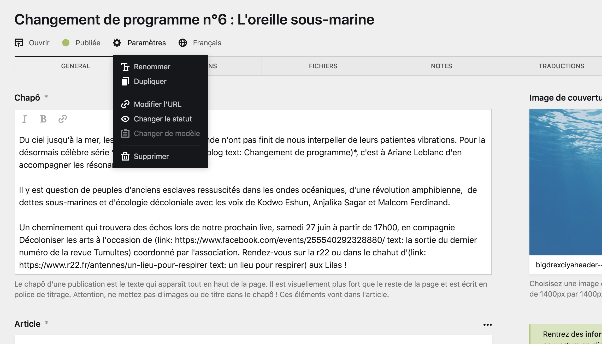
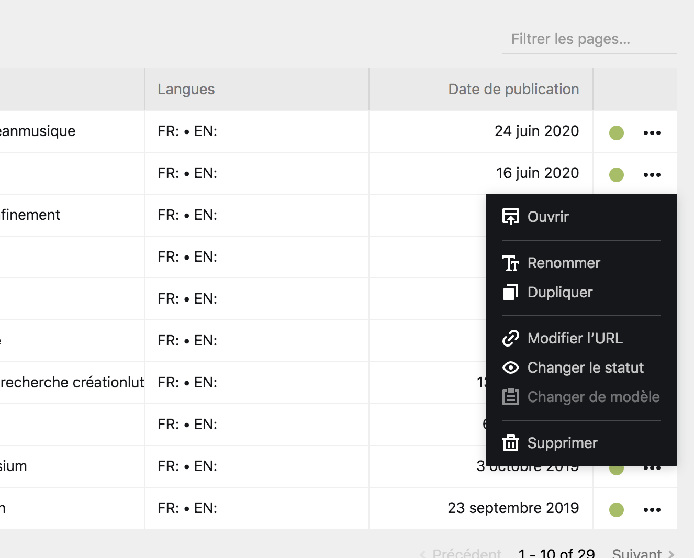
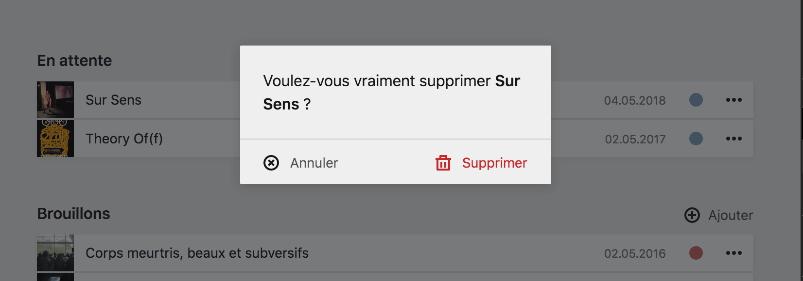

# Paramètres des pages et suppression

Chaque page possède plusieurs informations essentielles, qui sont la plupart du temps décidées par avance ou à sa création. Vous pouvez modifer ces informations au besoin dans les **paramètres de la page**.

## Les paramètres

Les paramètres sont accessibles soit :
- Depuis la **barre d'outil** de la page, en haut à droite, sous son titre.
- Depuis le bouton ```…``` dans les **sections de pages**, situé le plus souvent à gauche de la **boîte de page**, ou en dessous de la **carte de page**.





## Liste des paramètres

| Paramètre | Description |
|-----------|-------------|
| Ouvrir | Ce bouton est accessible depuis les sections de pages, et vous permet **d'ouvrir la page du Panel correspondant** à cette page du site. |
| Renommer | Cette option vous permet de **changer le titre** d'une page. |
| Dupliquer | Cette option vous permet de **créer une copie conforme** de la page en lui donnant un nouveau titre et un nouvel identifiant. |
| Modifier l'URL | Cette option vous permet de [changer l'identifiant]() de la page, et ainsi de modifier son URL au sein du site. |
| Changer le statut | Cette option vous permet de [changer le statut d'une page](), entre ```Brouillon```, ```Non listée``` ou ```Publiée```. |
| Changer le modèle | Vous pouvez changer le template, ou modèle d'une page. Cette option est inaccessible par défaut dans le Panel pour le site d'INACT, car les modèles sont toujours uniques. |
| Supprimer | Ce bouton vous permet de supprimer la page, son contenu et éventuellement ces sous-pages. C'est une action qui n'est pas à prendre à la légère car il n'est pas possible de récupérer du contenu supprimé |

****

## Supprimer une page

Pour supprimer une page, cliquez sur le bouton ```suprimmer``` dans les Paramètres de le page.

Une boîte modale d'information vous demandera, par précaution, de confirmer votre choix et la suppression de la page.

Si la page possède des sous-pages, la boîte modale vous demandera d'écrire le nom de la page pour confirmer votre choix, et ainsi éviter des erreurs potentiellement désastreuses pour le site.


