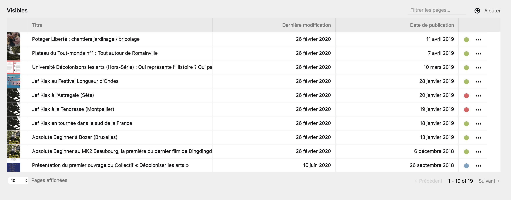
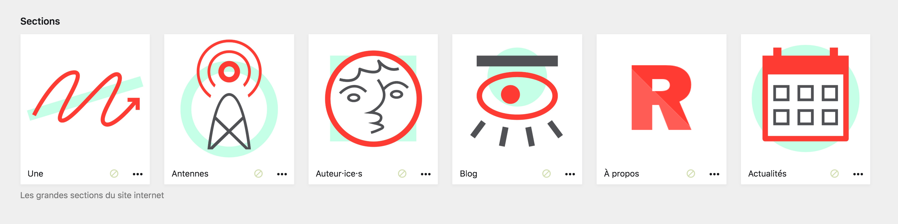
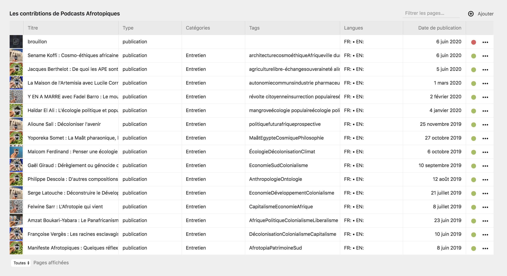

# Sections de pages

Au sein du Panel, vous rencontrerez réguilièrement des sections regroupant différentes pages. Ce sont les **sections de pages**.

Elles se présentent de différentes manière, selon le modèle de la page, sa portée, etc. Cette partie de la documentation regroupe ces différentes sections et en éclairci les particularités.

***

## La liste de pages

Ces section présente les pages sous la forme de liste, la plus part du temps triées par date, ou par ordre alphabétique.

La liste est elle-même divisée en trois catégories, représentant les [statuts des pages](). L'exemple suivant, tiré de la page **Blog** présente une section de page en liste avec les articles du blog du site internet.



| Élément | Description |
|---------|-------------|
| Aperçu de la page | Les listes utilisent souvent les images de couverture des pages, ou alors des icones, pour **présenter un premier aperçu de la page**. Vous pouvez cliquez sur ce carré pour ouvrir la page en question |
| Titre de la page | Le deuxième élément distinctif est le **titre de la page**, qui est également cliquable pour ouvrir la page |
| Date de publication | Les pages sont ensuite séparées par leur dates de publication, surtout lorsqu'elles sont tirées par ordre chronologique |
| Statut de la page | Un disque de couleur indique le [statut de la page](). Le disque est vert lorsque la page est publique (ou publiée). Le disque est bleu lorsque la page est non-listée. Le disque est rouge lorsque la pages est un brouillon |
| Le bouton ```…``` des options supplémentaires | Ce bouton permet d'ouvrir un menu déroulant [d'options supplémentaires](). |

***

## Les sections de pages importantes

Dans certains cas, les pages publiées (ou publiques) ont une importance primordiales au sein du site internet. Elles sont alors présentées dans des sections plus grandes, avec des **boîtes de pages** au lieu de la **liste** habituelle. Les images de couverture ou les icônes prennent alors plus de place, mais les différents boutons restent les même. On retrouve le titre de la page, son [statut]() et le bouton ```…``` [d'options supplémentaires]().

Les exemples suivants présentent des sections importantes, notamment celle des **Pages de premier niveau** du site mise en avant par des icônes, et les pages **Antenne** depuis la page **Antennes**, distinguées par leur image de couverture.




***

## Le tableau de pages

Dans certains cas, les pages sont présentées sous la forme d'un tableau, regroupant de nombreuses informations les concernant. Ceci pour accélerer la gestion des pages et le travail sur de nombreuses pages à la suite.

Ici par exemple, les contributions de l'antenne *Afrotopiques* dans le programme *Podcast Afrotopiques*.


