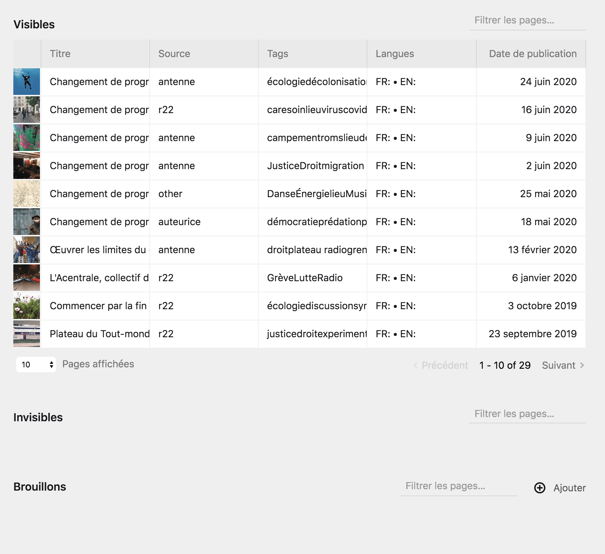
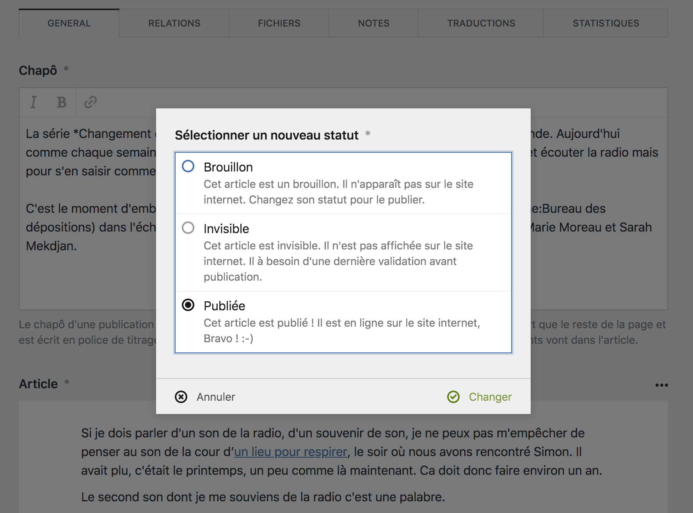
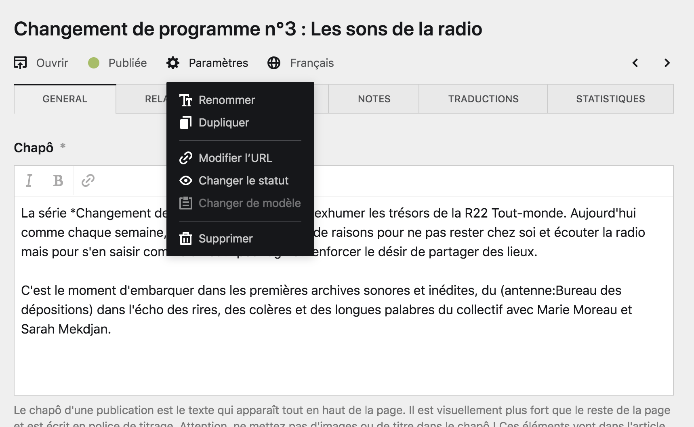
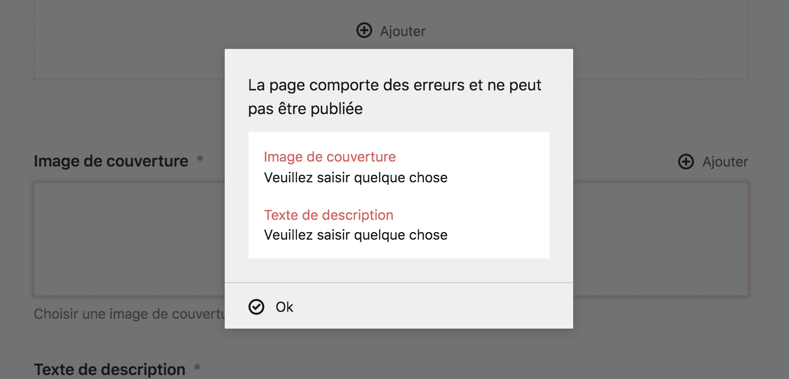
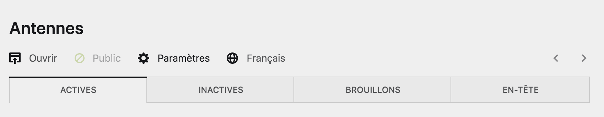

# Statuts des pages

Dans le panel, les pages peuvent avoir l'un des trois statuts suivants :




## Brouillons
Les pages en état de **brouillon n'existent qu'à l'intérieur du Panel**. Ce sont des pages de en élaboration, qui permettent de travailler en amont de la publication. Elles sont invisbles depuis le *front-office*. Il n'y a que les utilisateur·ice·s connecté·e·s sur le Panel qui puissent les voir et les modifier.



## Non listées
Les pages non listées ne sont pas visibles depuis le *front-office* mais **sont accessibles au public depuis leur URL**.

Ainsi, une page avec ce statut peut être une page spéciale, ou unique dans la hiérarchie du site. Par exemple, **la page d'erreur** est une page non listée.



## Public / Publiées

Les pages en état public sont visible depuis le *front-office* et accessible au public. Elles sont publiées au sein du site internet et **sont employées comme les pages actives du site**.

Toutes les pages accessibles depuis le site internet, via des menus ou des liens, sont des pages publiées.



Chaque statut est notifé par une couleur attribuée à la page :
- Les **pages Brouillons** sont représentés de couleur rouge.
- Les **pages Non listées** sont représentées par une couleur bleue.
- Les **pages Public ou Publiées** sont représentées par une couleur verte.

****

## Organisation des pages par statut

**Les pages sont organisées dans le Panel en fonction de leur statut**. Vous trouverez ainsi régluièrement des sections rassemblant toutes les pages publiques (ou publiées), d'autre rassemblant toutes les pages non listées et enfin, d'autres regroupant les brouillons.

Souvent, ces sections prennent des présentations différentes et accordent plus d'importance visuelle aux pages publiées (ou publiques) pour bien les différencier des autres. Comme dans l'exemple suivant :



****

## Changer le statut d'une page

Pour publier une page, vous pouvez cliquer sur le bouton correspondant à son statut, par exemple : ```Brouillon```, dans la barre d'outils de le page, ou alors cliquer sur le bouton ```Paramètres``` > ```Changer le status```.

Le formulaire de changement de statut apparaîtera alors, au sein duquel vous pourrez modfier l'état de la page.






**Attention** :
Vous ne pourrez publier un brouillon que si **tous les champs obligatoires de la page ont été rempli**, et si tous les champs sont valides. Ceci pour éviter des erreurs dans le site internet.





**Bon à savoir** :
La plupart du temps, il n'est pas nécessaire de supprimer une page, changer son statut de ```publiée``` à ```brouillon``` et suffisant pour ne plus la rendre visible sur le site et conserver le travail déjà effectué.


****

## Statut vérouillé

Pour certaine page du site, **leur statut est vérouillé et il n'est pas possible de le changer**.
C'est principalement le cas pour les pages importantes du site, ou présentes à son premier niveau hiérarchique.

Ce sont des page qu'il ne sert à rien de dé-publier ou de masquer du site internet, au risque de créer des erreurs.

Les pages au statut vérouillé sont visibles par **l'icône d'un rond évidé et barré** qui remplace le rond plein et coloré habituel.


