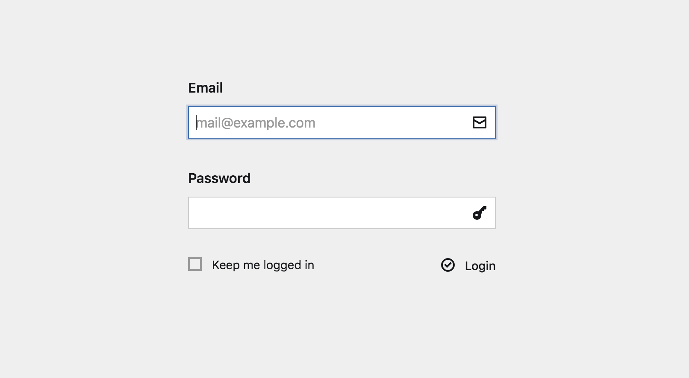
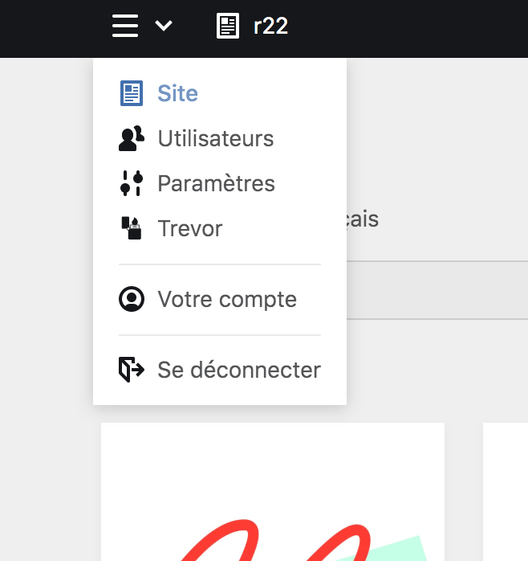

# Se connecter ou se déconnecter du Panel

Pour modifier le site internet, vous avez besoin de vous connecter au Panel.

## Se connecter au Panel

Pour vous connecter au panel, vous devez vous rendre à l’adresse : <https://www.r22.fr/panel/> avec votre navigateur.

Un écran de connexion s’affiche, avec un formulaire. Dans les deux champs de celui-ci, renseignez **l’email** et le **mot de passe** de votre compte utilisateur·ice puis cliquez sur bouton ````login````. Vous pouvez, en plus, cocher une case pour demander au site internet de vos garder en ligne le plus longtemps possible.



***

## Se déconnecter du Panel


Pour vous déconnecter du Panel, allez sur le **menu déroulant** représenté par un **bouton hamburger**. Dans la liste d’options affichées, vous devez cliquer sur le bouton ````se déconnecter```` en bas de la liste pour vous déconnecter du Panel.


