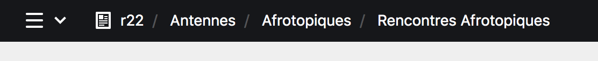
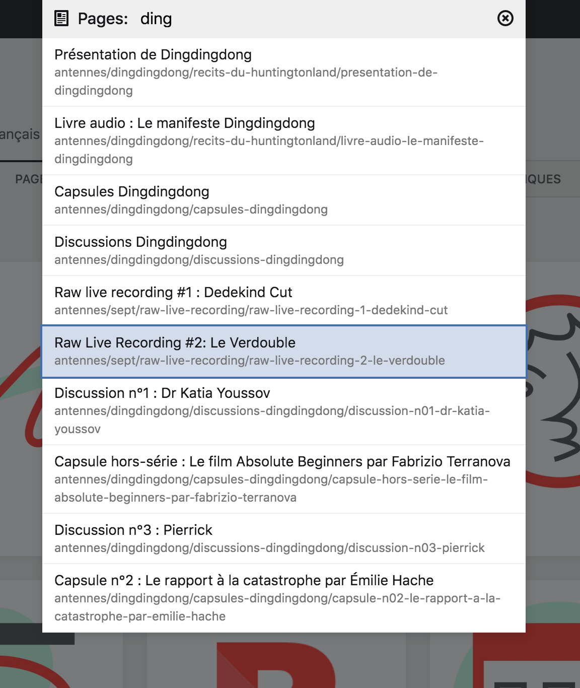

# Interface du Panel

En elle-même, l'interface est assez intuitive. Elle ressemble à tout autre logiciel d'édition de contenu que vous avez déjà pu recontrer.

Toutefois, la présente documentation fait régulièrement référence à quelques éléments important de son interface, aussi, il est important de les connaître et de savoir les utiliser.

---

## Haut de page

### Header

La barre d'en-tête noire, en haut du site internet, ou **header**, comporte des éléments de navigation importants du Panel.


Le **header** du Panel, à gauche, le **hamburger** qui donne accès au menu déroulant, au centre, le chemin d'arborescence et à droite, la loupe donnant accès à la recherche.

### Hamburger & Menu déroulant

À gauche de celle-ci, vous trouverez le bouton **hamburger** qui vous permet d’accéder au **menu déroulant** du site. Ce menu liste les sections principales :




<--->

| Bouton | Description |
|--------|-------------|
| ````Site```` | Le **contenu du site internet** |
| ````Utilisateurs```` | Les [comptes utilisateurs]() du site |
| ````Paramètres```` | Les **paramètres du site internet** |
| ````Votre compte```` | La page du [compte utilisateur]() que vous employez actuellement |
| ````Se déconnecter```` | La possibilité de [se déconnecter]() du Panel |



****

## Fil d'Ariane (*Breadcrumb*)

Au centre du **header** est affiché le **Fil d'Ariane**, c'est  à dire la liste des pages parentes[^2] à la page dans laquelle vous vous trouvez. Dit autrement, c’est le chemin des pages qui contiennent la page actuelle. Vous pouvez cliquer sur le nom d’une page pour vous y rendre.

Dans l'exemple suivant, on retrouve la racine du site, la page ````Antennes````, l'antenne ````Afrotopiques```` et son programme ````Rencontres Afrotopiques````.

[^2]: On parle de page parente concernant une page qui contient des sous-pages, et de page enfant pour une sous-page d'une page parente. Un page peut être parente de sous-pages et elle-même sous-page d'une autre page partente.


graph LR
1[r22]
2[Antennes]
3[Afrotopiques]
4[Rencontres Afrotopiques]

1--Parente de--> 2
2--Parente de-->3
3--Parente de-->4

4--Enfant de-->3
3--Enfant de-->2
2--Enfant de-->1




## Recherche

Le bouton en forme de **loupe** vous permet d’accéder à la recherche du Panel.

Grâce à elle, vous pouvez rechercher des pages précises grâce à une liste de mot clés. Ainsi, vous pouvez accéder plus rapidement à des sections importantes du site internet. Elle est très pratique pour trouver des pages profondément enfouies dans l’arborescence du site.

Une recherche sur ````ding```` donne une liste des pages ou ce mot est référencé.


