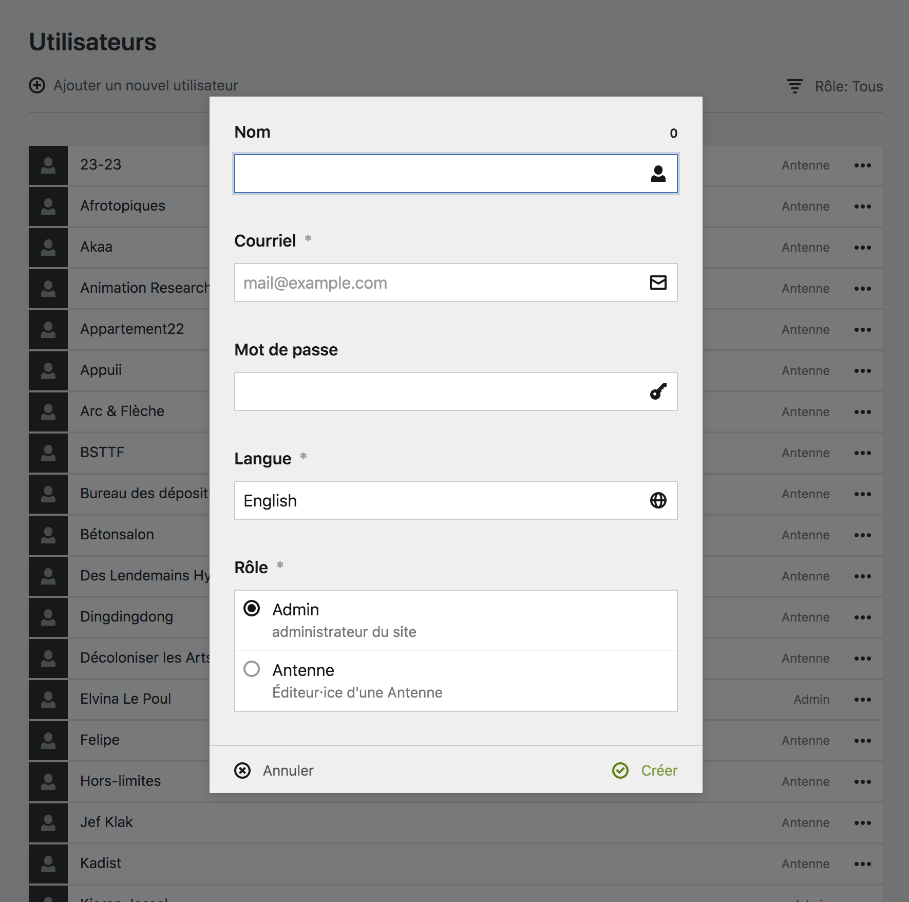
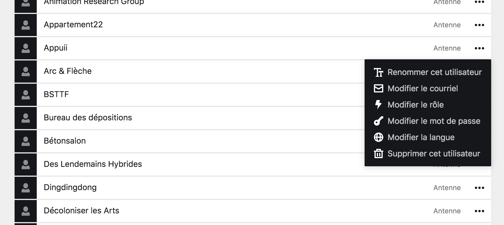
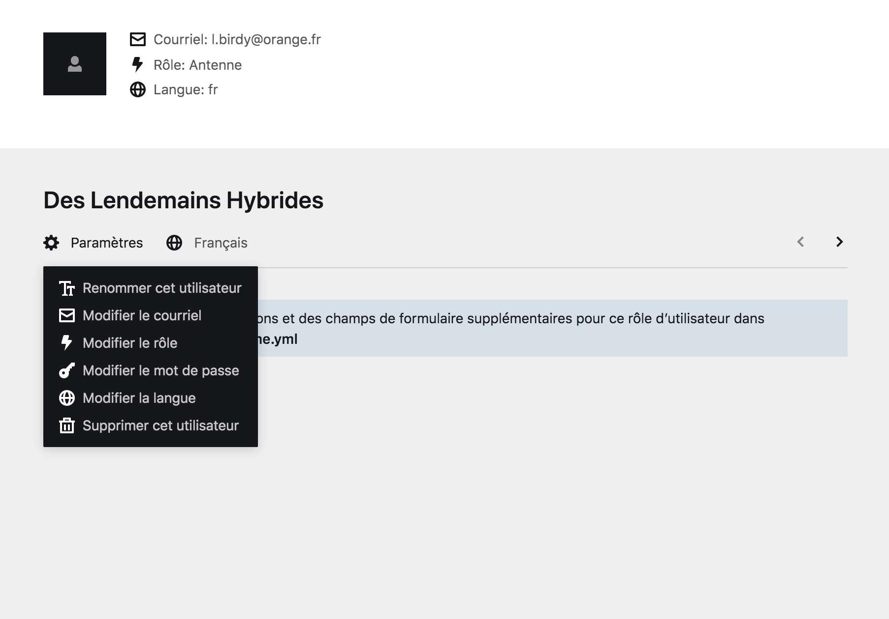

# Actions de compte

Tous les comptes peuvent être gérés et modifés depuis le Panel :
- Vous pouvez **créer** autant de compte que nécessaires.
- **Modifier** leur informations.
- Les **supprimer** au besoin.

Ces actions vous permettent de garder un travail d'équipe correctement organisé et efficace.

## Créer un compte utilisateur

Pour créer un nouveau compte utilistateur·ice, ouvrez le menu avec le [hamburger]() et cliquez sur le boutons ````Utilisateurs````. Vous trouverez le bouton ````Ajouter un nouvel utilisateur```` dans le coin gauche de la page, qui vous amènera au **formulaire de création d’utilistateur·ice**.



Remplissez les informations requises, comme **l’adresse email** et le **mot de passe**, et cliquez sur le bouton ````créer```` pour ajouter le·la nouvel·le utilistateur·ice. Également, renseigner la langue ````Français```` pour que l’interface du **Panel** soit en français pour cet·te utilisateur·ice.

| Rôle | Description |
|------|-------------|
| Admin | L'utilisateur·ice à accès à l'intégralité des options du site internet et peut tout faire. **Ce rôle est à réserver à l'équipe de la radio. |
| Antenne | L'utilisateur·ice à un accès limité au site internet, et ne peut pas en modifier l'intégralité du contenu. Ce rôle est pour les éditeurs d'Antenne et autre collaborateur·trice du site internet qui n'ont pas besoin d'un accès complet. |


**À propos**
Vous devriez éviter d'utiliser une même adresse email pour plusieurs utilisateur·ice·s du site, sinon cela risque d’engendrer des problèmes de connexion.



**Attention**
Notez bien le mot de passe de l’utilisateur·ice à sa création, il n’y a pas de moyen de le récupérer par la suite.


****

## Modifier un compte

Pour accéder aux **options d’un compte utilistateur·ice**, cliquez sur l’icone ````options```` à côté de l’utilistateur·ice à partir de la [page Utilisateurs]() pour ouvrir le menu déroulant comportant les options de modification.



Vous pouvez également accéder au menu déroulant de modification à partir de la page d’un [compte utilistateur·ice](), en cliquant sur le bouton ````Paramètres````.



Les comptes utilisateur·ice·s sont identifiés par leur **adresse email**, cependant vous pouvez leur donner un nom plus reconnaissable. Il est possible de changer le nom à tout moment en cliquant sur le bouton ````Renommer cet utilisateur````.

Vous pouvez également modifier **l'adresse email**, le **mot de passe**, et la **langue utilisée** par le Panel, et ce en cliquant sur les boutons correspondants.

****

## Supprimer un compte

Pour **supprimer un compte utilisateur·ice**, cliquez sur le bouton ````Supprimer cet utilisateur````. Tous les comptes peuvent être supprimés sauf le dernier d’entre eux.
