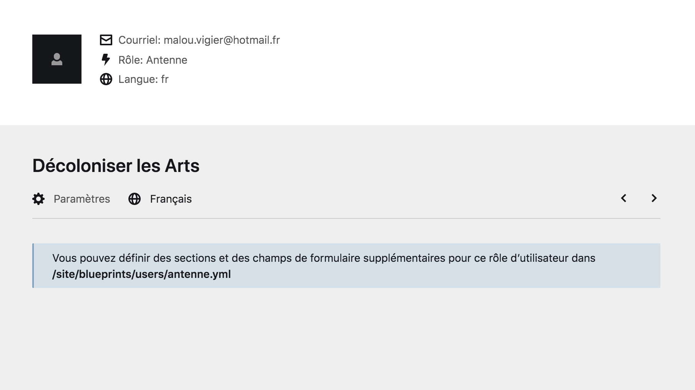
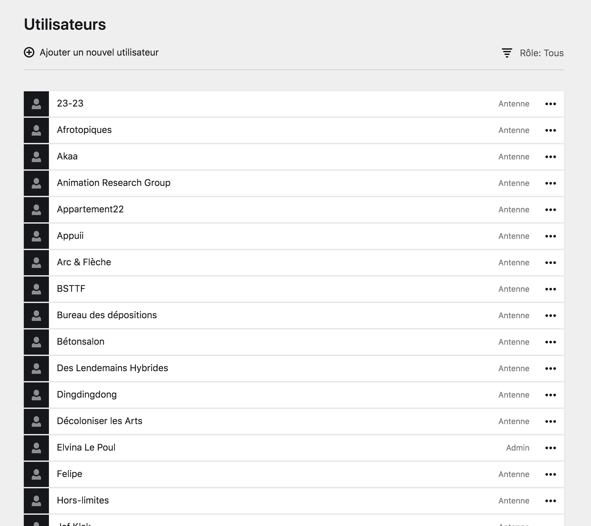

# Les pages des utilistateur·ice·s

Au sein du Panel, il est important de bien différencier la **page Utilisateur**, qui est la page personnelle de chaque utilisateur·ice du Panel, et la **page Utilisateurs**, qui regroupe l'ensemble des utilisateur·ice·s du Panel.

## Page Utilisateur

Chaque compte possède une page spécifique qui les est dédiée. Elle recense les informations de ce compte et permet de modifier ses informations.

Pour accéder à une page compte, allez sur le [hamburger]() du menu et cliquez sur le bouton ````votre compte````.



****

## Page Utilisateurs

La page **Utilisateurs** regroupe tous les comptes utilistateur·ice·s que possède le site internet.

Vous pouvez accéder à des utilistateur·ice·s en particuliers, créer, modifier ou supprimer des comptes à partir de cette page. Pour vous y rendre, allez sur le [hamburger]() et cliquer sur le bouton ````utilisateurs````.


